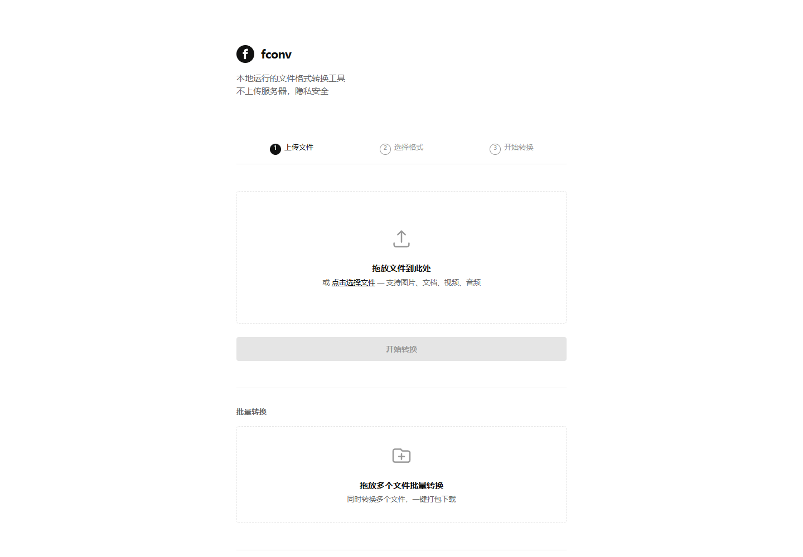
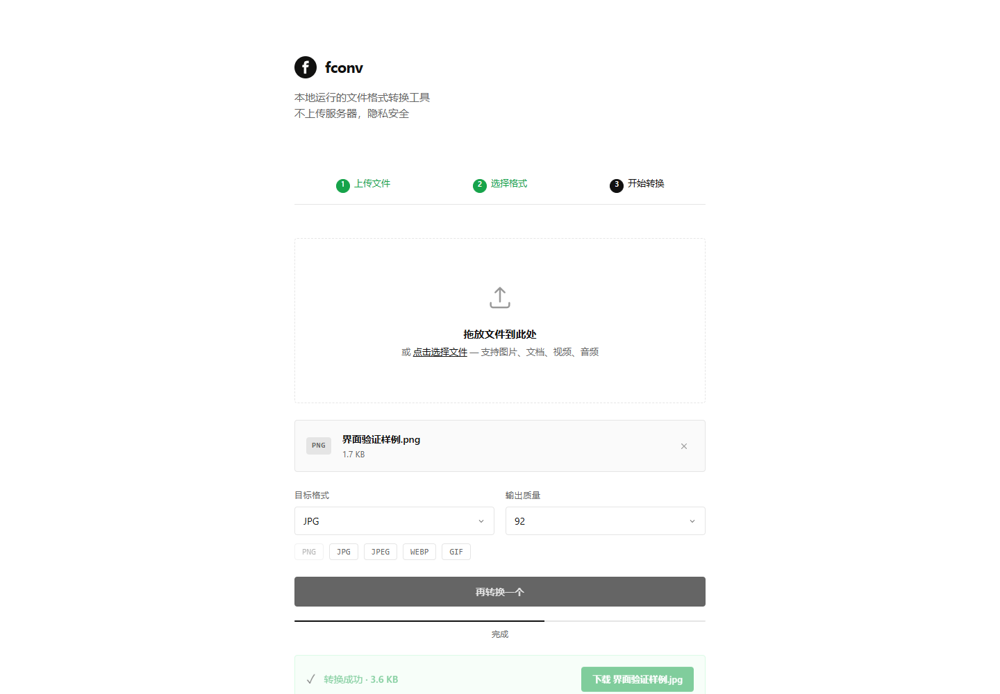
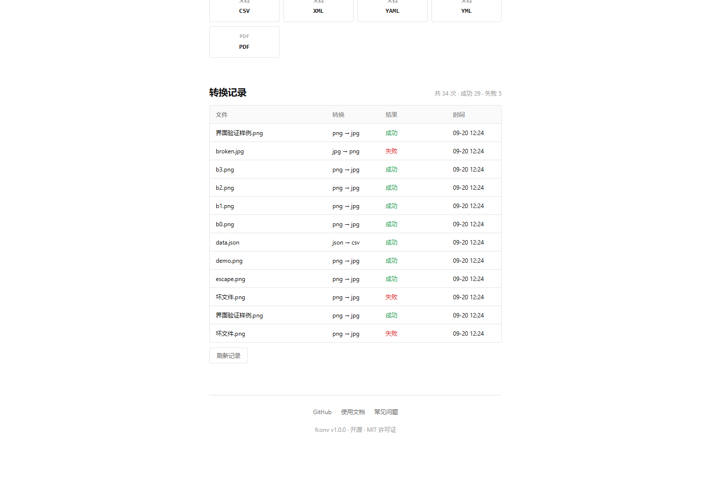

<p align="center">
  
</p>

<h1 align="center">fconv</h1>

<p align="center">
  <b>本地运行的文件格式转换工具</b><br>
  图片 · 文档 · 视频 · 音频 · PDF，一个入口搞定<br>
  <b>文件不上传，全程离线</b>
</p>

<p align="center">
  
  
  
  
  
</p>

---

## 这是什么

`fconv` 是一个**跑在你自己电脑上**的文件格式转换工具。拖进文件、选目标格式、点转换，完事下载——文件从头到尾没有离开过本机。

它解决的是很具体的麻烦：想转个图片格式却要先装一堆软件；在线转换网站要上传、有大小限制、还可能把文件留下。`fconv` 把常用的图片 / 文档 / 视频 / 音频 / PDF 转换收在一个界面里，双击就能用，也可以当命令行工具使。

## 界面预览





转换记录会持久保存在本机，刷新页面也不丢：



## 特性

| 特性 | 说明 |
|---|---|
| **一个入口** | 图片 / 文档 / 视频 / 音频 / PDF 互转，不用装一堆软件 |
| **三步操作** | 拖入文件 → 选目标格式 → 点转换，完事下载 |
| **批量处理** | 一次拖进多个文件，并发转换，打包成 ZIP 一键下载 |
| **智能识别** | 按文件真实魔数 + 扩展名双重判断，改名文件也认得出 |
| **错误友好** | 损坏文件 / 空文件 / 不支持格式都有明确中文提示，不甩堆栈 |
| **转换记录** | 每次转换都写进本机历史，谁转了、转了啥、成没成，都能查 |
| **全程离线** | 服务只监听 `127.0.0.1`，不联网、不上传、不埋点 |
| **双入口** | Web 界面 + 命令行，也能 `pip install` 当库用 |

## 支持的格式

| 类别 | 格式 | 说明 |
|---|---|---|
| 图片 | PNG · JPG · GIF · BMP · TIFF · WEBP · ICO | 任意互转，带透明通道自动处理 |
| 文档 | TXT · MD · HTML · JSON · CSV · XML · YAML | 结构化与非结构化都能互转 |
| PDF | PDF → TXT / MD / HTML | 纯 Python（pypdf），装好即用 |
| PDF → 图片 | PDF → PNG / JPG | 需可选依赖 PyMuPDF，多页自动打包 ZIP |
| 视频 | MP4 · MKV · AVI · MOV · WMV · FLV · WEBM | 需 FFmpeg；可导出 GIF 动图 |
| 音频 | MP3 · WAV · OGG · FLAC · AAC · M4A | 需 FFmpeg；WMA 可作输入 |

> 完整格式对一共 **201 组**，每一条都跑过真实转换验证（见「验证」一节）。

## 快速开始

### 方式一：便携版（不想碰命令行的人用这个）

1. 下载 `fconv-portable-v1.0.0.zip` 并解压（整包解压，别只解一个文件）
2. 双击 **`启动fconv.vbs`** —— 没有黑窗口，自动起服务并打开浏览器
3. （可选）双击 **`安装到桌面.bat`** —— 在桌面和「工具箱」里生成带图标的快捷方式

> 需要本机有 **Python 3.10+**；首次运行会自动补装依赖（需要联网一次）。
> 解压目录里如果有 `python\` 文件夹（内置运行时），则完全免装 Python。

便携包里的入口一览：

| 文件 | 作用 |
|---|---|
| `启动fconv.vbs` | 无窗口启动（推荐日常使用） |
| `启动fconv-最小化.bat` | 最小化启动，留一个可查看的最小窗口 |
| `启动fconv.bat` | 调试窗口启动，出问题看这里 |
| `停止fconv.bat` | 停止后台服务，释放 8765 端口 |
| `安装到桌面.bat` | 创建桌面 + 工具箱快捷方式（带新图标） |
| `下载最新版.bat` | 从 GitHub Releases 拉取最新便携包（三镜像自动切换） |
| `build-portable.bat` | 自己重新打包一份便携版 |
| `start.bat` | 英文版启动脚本（给非中文系统） |

### 方式二：源码运行

```bash
git clone https://github.com/x1303145921/fconv.git
cd fconv
pip install -r requirements.txt
python src/web/server.py        # 打开 http://127.0.0.1:8765
```

### 方式三：命令行 / 当库用

```bash
pip install -e .

fconv 输入.png 输出.jpg                  # 单文件（可省略 convert）
fconv convert 输入.mp4 输出.mkv --crf 20  # 视频质量
fconv detect 某文件.bin                  # 看真实格式（不看扩展名）
fconv formats                            # 列出支持的格式对
fconv info                               # 完整路由表
fconv batch *.png --format webp -o out/  # 批量转换到指定目录
fconv version
```

```python
from fconv import get_router

result = get_router().convert("报表.xlsx.png", "报表.jpg", quality=90)
print(result.ok, result.output_path)
```

> 想装 PDF→图片 或 YAML 方向：
> `pip install "PyMuPDF>=1.23" PyYAML`（PyMuPDF 是 AGPL，详见 `THIRD-PARTY-NOTICES.txt`）。

## 界面与交互

| 区域 | 说明 |
|---|---|
| 上传区 | 拖放或点击选择，支持任意文件 |
| 格式选择 | 按文件类型给出建议格式，图片/WebP 可调质量 |
| 转换进度 | 实时进度条 + 状态文案 |
| 结果区 | 成功给下载按钮，失败给中文原因 |
| 批量区 | 多文件排队、逐个显示结果、一键下载 ZIP |
| 转换记录 | 最近 12 条（`/api/history` 可拉全量），含文件、转换方向、结果、时间 |

## HTTP 接口

| 方法 | 路径 | 说明 |
|---|---|---|
| `GET` | `/api/health` | 健康检查（含版本号、FFmpeg 是否可用） |
| `GET` | `/api/formats` | 支持的源格式与可达目标格式 |
| `POST` | `/api/convert` | 单文件转换，立即返回 `task_id` |
| `GET` | `/api/tasks/<id>` | 查询任务状态 |
| `GET` | `/api/download/<id>` | 下载转换结果 |
| `POST` | `/api/batch-convert` | 批量转换，返回逐条结果 + ZIP |
| `GET` | `/api/download-batch/<zip>` | 下载批量 ZIP |
| `GET` | `/api/history` | 转换历史（`?limit=&status=`） |
| `GET` | `/api/stats` | 统计信息 |
| `POST` | `/api/benchmark` | 内置性能自测 |

```bash
curl -F "file=@photo.png" -F "format=jpg" http://127.0.0.1:8765/api/convert
# {"file":"photo.png","status":"processing","task_id":"9c038eed"}
```

## 项目结构

```
fconv/
├── src/
│   ├── fconv/                 # 核心库
│   │   ├── core.py            # Converter 协议 / ConvertResult / ErrorCode
│   │   ├── router.py          # 数据驱动格式路由（含别名归一）
│   │   ├── sniffer.py         # 魔数 + 扩展名嗅探（RIFF/ISO-BMFF 容器解析）
│   │   ├── ffmpeg.py          # FFmpeg 定位与调用封装
│   │   ├── history.py         # 转换历史（JSONL）+ 轮转日志
│   │   ├── cli.py             # 命令行
│   │   ├── batch.py           # 并发批量转换 + ZIP
│   │   └── converters/        # image / pdf / text / video / audio
│   └── web/                   # Flask 服务 + 单页界面
├── assets/                    # 图标（svg / ico / 多尺寸 png）+ 图标源图
├── benchmarks/                # 性能基准 + 201 格式对冒烟测试
├── scripts/                   # 图标与启动器生成脚本
├── tests/                     # 单元测试 115 项 + API 端到端
├── docs/                      # 截图、发布说明、优化报告
├── 启动fconv.vbs 等           # 便携版入口套件
└── build-portable.bat         # 一键打包
```

## 运行环境

| 项目 | 要求 |
|---|---|
| 操作系统 | Windows 10 / 11（主要验证环境） |
| Python | 3.10 及以上（实测 3.13.12） |
| 核心依赖 | Pillow ≥10、pypdf ≥4、Flask ≥3（实测 Pillow 12.2.0 / pypdf 6.19.0 / Flask 3.1.3） |
| 可选依赖 | PyYAML ≥6（YAML 方向）、PyMuPDF ≥1.23（PDF→图片，AGPL） |
| 可选组件 | FFmpeg（音视频转换）；本机实测 ffmpeg 9.0 |

FFmpeg 的查找顺序：环境变量 `FCONV_FFMPEG` → 项目内 `tools/ffmpeg/bin/` → 系统 `PATH`。找不到时音视频转换会明确提示，其他格式不受影响。

## 测试与验证

```bash
python -m pytest tests/ -q                    # 单元测试（115 项）
python -m pytest tests/ --cov=src/fconv       # 带覆盖率
python tests/api_e2e.py                       # API 端到端（需先起服务）
python benchmarks/smoke_test.py --with-ffmpeg # 201 个格式对真实转换
python benchmarks/benchmark.py                # 性能基准
```

当前状态（2026-09-20，本机实测）：

| 项目 | 结果 |
|---|---|
| 单元测试 | **115 / 115 通过** |
| API 端到端 | **14 / 14 通过** |
| 浏览器交互 | **12 / 12 通过**（含坏文件、刷新后历史仍在、移动端） |
| 格式对矩阵 | **201 / 201 真实转换通过** |
| 图片转换平均 | 约 1–25 ms（100px–1920px） |
| 1920×1080 PNG→JPG | 约 90 ms |

## 常见问题

**Q：双击 `启动fconv.vbs` 没反应 / 浏览器没打开？**
A：先双击 `启动fconv.bat`（调试窗口版），错误信息会显示在黑窗口里。绝大多数情况是没装 Python 或依赖没装上。

**Q：提示 `未找到 FFmpeg`？**
A：视频/音频转换需要 FFmpeg。三种做法任选：装好并加入 `PATH`；设置环境变量 `FCONV_FFMPEG` 指向 `ffmpeg.exe`；或把 ffmpeg 放到项目的 `tools/ffmpeg/bin/` 下。图片和文档转换不受影响。

**Q：PDF 转图片报「需要可选依赖 PyMuPDF」？**
A：执行 `pip install pymupdf`。注意 PyMuPDF 是 **AGPL-3.0** 许可，本项目不分发它，请自行确认使用场景是否合适。

**Q：8765 端口被占用？**
A：启动脚本会自动清掉占用该端口的旧进程；也可以双击 `停止fconv.bat`，或用环境变量 `FCONV_PORT=9000` 换端口。

**Q：上传大文件失败了？**
A：单次请求上限 200MB，超了会返回中文提示。超大文件建议先用命令行分批处理。

**Q：转换记录存在哪？会不会上传？**
A：存在项目目录下的 `logs/history.jsonl`（运行日志在 `logs/fconv.log`），都在 `.gitignore` 里。服务只监听本机回环地址，不联网、不上传。

**Q：我的文件会被留在电脑上吗？**
A：上传与产物放在 `src/uploads/` 下按任务分的子目录里，默认 24 小时后自动清理；也可以直接删掉整个目录。

## 开发

```bash
git clone https://github.com/x1303145921/fconv.git
cd fconv
pip install -e ".[dev]"
python -m pytest tests/ -q
```

代码风格：PEP 8 + type hints；新增格式只要写一个转换器类并声明 `source_formats` / `target_formats`，路由表自动生效。详见 [CONTRIBUTING.md](CONTRIBUTING.md)。

## 致谢

- [Pillow](https://python-pillow.org/) —— 图片读写的事实标准
- [pypdf](https://pypdf.readthedocs.io/) —— 纯 Python 的 PDF 处理
- [Flask](https://flask.palletsprojects.com/) —— 轻量 Web 服务
- [FFmpeg](https://ffmpeg.org/) —— 音视频转换的地基
- 图标字形参考自一张公开 logo 图（已裁圆、换色并描成矢量），见 `assets/icon-source.webp`

## 许可证

[MIT](LICENSE) © 2026 fconv contributors

第三方组件与许可清单见 [THIRD-PARTY-NOTICES.txt](THIRD-PARTY-NOTICES.txt)。
